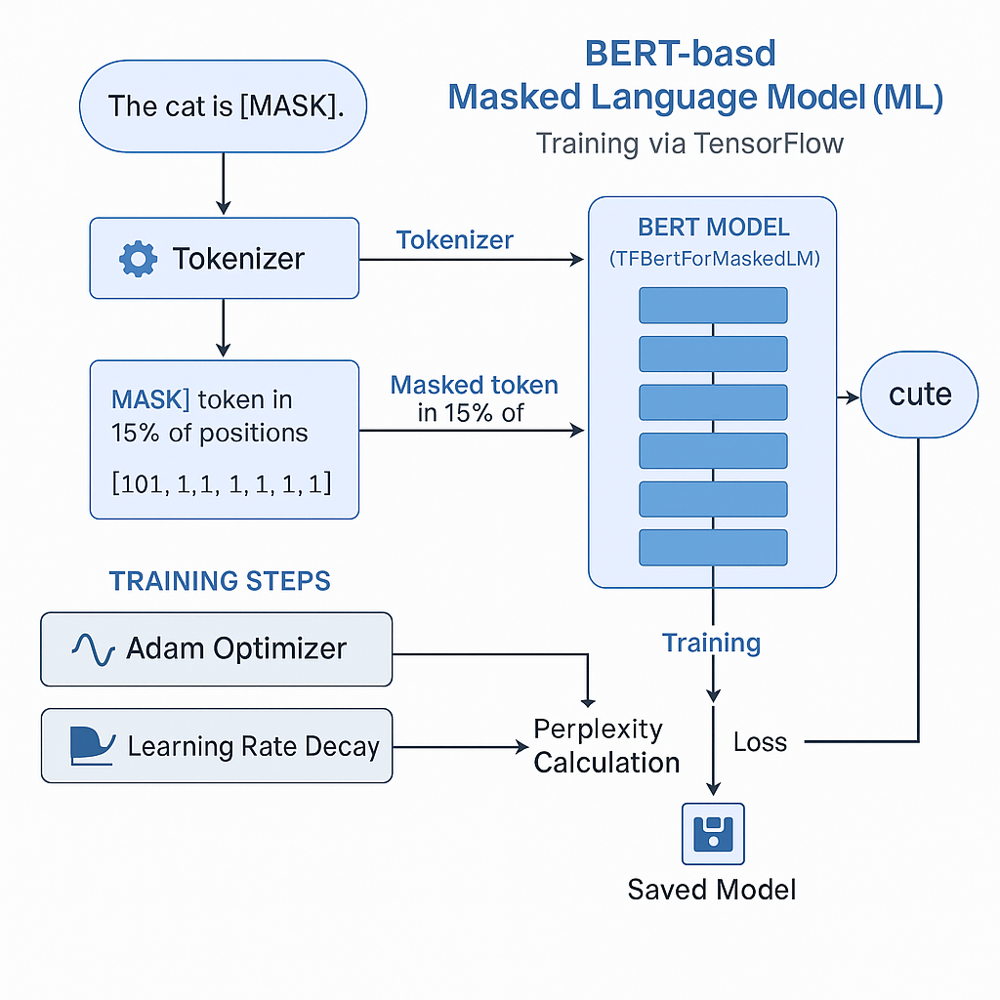
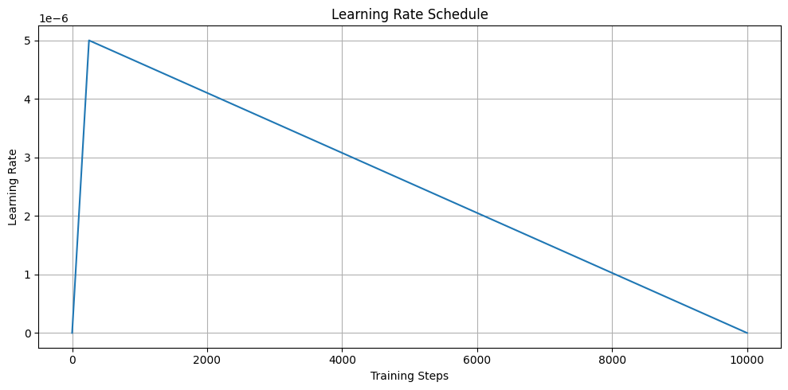

# TF-BERT Word Imputer

This project implements a **Masked Language Model (MLM)** using `TFBertForMaskedLM` to predict missing words in sentences. It utilizes the **BERT-Large Uncased** model fine-tuned on a custom sentence dataset with dynamic token masking. The final model achieves a validation **perplexity of 8.48** and Test-Set **perplexity of 10.51**.

### Model architecture:


### Learning rate schedule:

---

## 🧰 Features

* Built using **TensorFlow** and **Hugging Face Transformers** with `TFBertForMaskedLM`.
* Custom dataset loaded via Hugging Face `datasets` library.
* Dynamic masking using `DataCollatorForLanguageModeling`.
* Polynomial learning rate decay and Adam optimizer.
* Early stopping for stability.
* Final model saved in `assets/mlm_tf` directory.

---

## 📊 Training Configuration

```python
model_name = "bert-large-uncased"
max_seq_length = 128
batch_size = 8
num_train_epochs = 10
learning_rate = 5e-6 (highest)
mlm_probability = 0.15
```

---
## 🔹 Results

* **Test Perplexity**: 10.51
* **Model Size**: \~1.3GB (BERT-Large)

---
### 📊 Perplexity Score
**Perplexity** is a standard metric for evaluating language models. It measures how well the model predicts masked tokens in a sentence. Lower perplexity implies better generalization and stronger predictions.

#### 🧮 Mathematical Formula
```
Perplexity = exp(CrossEntropyLoss)
```
This formula assumes the model outputs a probability distribution over the vocabulary for each masked token. The lower the average negative log-probability, the better the model.

#### 📌 Why Use Perplexity?
Perplexity is ideal for **Masked Language Modeling (MLM)** because:
- It directly reflects how confidently the model predicts masked words.
- It's interpretable: e.g., a perplexity of 8 means the model is as uncertain as randomly choosing among 8 likely tokens.
- It's differentiable and aligns with the training objective (cross-entropy).

#### ✅ Result in This Project
After training a **BERT-large-uncased** MLM on a custom sentence dataset, the model achieved:
```
Validation Perplexity: 8.48
```
This indicates strong learning and reliable prediction of masked tokens in natural language sentences.

----
💡 You can use perplexity as an early stopping metric, or compare across datasets/models.

## 💼 Use Case

This model can be used for:

* Filling in blanks in educational apps
* Grammatical sentence correction
* Augmenting incomplete text data
